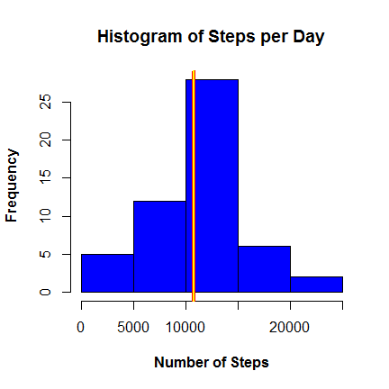
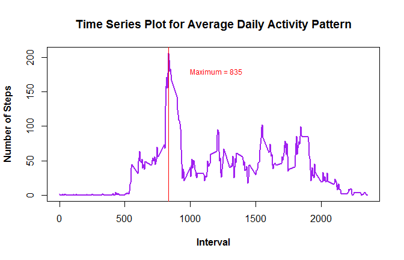
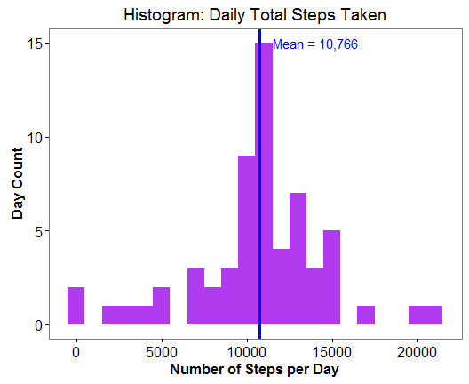
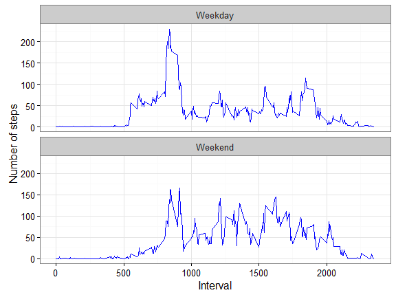

# Activity Monitoring Data Analysis
[Leigh Matthews] (https://github.com/leigh-math)  
April 28, 2016  

This report is the first assignment in the Reproducible Research course as part of the Coursera Data Science track and is created using an R Markdown document that can be processed by *knitr* and be transformed into an HTML file. 

  

### Introduction to the Activity Dataset

"It is now possible to collect a large amount of data about personal movement using activity monitoring devices such as a Fitbit, Nike Fuelband, or Jawbone Up. These devices are part of the 'quantified self' movement - a group of enthusiasts who take measurements about themselves regularly to improve their health, to find patterns in their behavior, or because they are tech geeks. But these data remain under-utilized both because the raw data are hard to obtain and there is a lack of statistical methods and software for processing and interpreting the data.

This assignment uses data from a personal activity monitoring device. This device collects data at 5 minute intervals throughout the day. The data consists of two months of data from an anonymous individual collected during the months of October and November, 2012 and include the number of steps taken in 5 minute intervals each day."
***    
   
####Activity Monitoring Data  
The given dataset "activity.csv" contains total of 17,568 observations and 3 variables.The variables included are:   
    1. steps: Number of steps taking in a 5-minute interval (missing values are coded as NA)  
  	2. date: The date on which the measurement was taken in YYYY-MM-DD format  
  	3. interval: Identifier for the 5-minute interval in which measurement was taken


***
***
  
  
### Loading and Pre-Processing the Activity Data

This analysis begins with loading the required R packages into the R Studio.


After downloading and unzipping the "Activity.csv" file, load the dataset into R.  To pre-process the data, convert the date variable into a date class.  To simplify the analysis, for now, the missing values can be removed.  


```r
activity <- read.csv("C:/Users/Leigh/Documents/Reproducible Research/RepData_PeerAssessment1/activity.csv", header=TRUE)  
activity$date <- as.Date(as.character(activity$date), "%Y-%m-%d")
activity.noNA <- na.omit(activity)       # Remove missing values 
```

There are a total of 61 days, 288 intervals per day, and 15,264 total observations in the dataset, excluding missing values.


***
***  

### Question 1: Mean Total Steps Per Day   
        
     

**(a). Calculate the total number of steps taken per day. **


The aggregate function can be used to sum the number of steps at each interval for the day, as shown below. Then the overall mean and median number of steps per day for the center of distribution in the data (ignoring any missing values) can be calculated as follows.


```r
steps.per.day <- aggregate(activity.noNA$steps, by = list(activity.noNA$date), sum)
```

The mean number of steps taken daily is:

```r
(mean.steps <- mean(steps.per.day$x))
```

```
## [1] 10766.19
```

The median number of steps taken daily is:

```r
(median.steps <- median(steps.per.day$x))
```

```
## [1] 10765
```

The mean number of steps per day is 10766.19 and the median number of steps per day is 10,765 for this dataset.

***


**(b). Make a histogram of the total number of steps taken per day **

A histogram can be used to display the number of steps per day to see the distribution of the data. Create a histogram (using type = "l") of the total steps per day. 

```r
hist(steps.per.day$x, col= "blue", main = "Histogram of Steps per Day", 
     font.main = 2, cex.main = 1.2, xlab = "Number of Steps", font.lab = 2 )
abline(v=mean.steps, col="red", lwd = 4)
abline(v=median.steps, col="yellow", lwd = 2)
```



The histogram shows that the distribution of total daily steps may not be very skewed because the mean total steps per day (yellow line) and the median total steps per day (red line) are not significantly different.


   
***
***      

### Question 2: Average Daily Activity Pattern   
   
  
**(a). Which 5-minute interval, on average across all the days, contains the maximum number of steps?**

Begin by calculating the total number of steps by 5-minute intervals (using the *aggregate* function) and save them in a data frame called 'steps.per.interval'.  Next, determine which interval is the maximum. Note: In this part of the assignment, missing values  are still being ignored.


```r
steps.per.interval = aggregate(activity.noNA$steps, by=list(interval = activity.noNA$interval), FUN=mean)
steps.per.interval$interval <- round(steps.per.interval$interval, 0)        # Round to integers for plots
colnames(steps.per.interval) <- c("interval", "steps")
(max.interval <- steps.per.interval[which.max(steps.per.interval$steps), ]) # Interval with maximum steps
```

```
##     interval    steps
## 104      835 206.1698
```
The 835th 5-minute interval contains the maximum number of steps, on average across all the days in the dataset. 

***

**(b). Make a time series plot (type = "l") of the 5-minute interval (x-axis) and the average number of steps taken, averaged across all days (y-axis).**

The Time Series Plot for the average steps taken vs. the 5-minute intervals can be created in the *base* package with the *plot* function. 


```r
plot(steps.per.interval, type = "l", col = "purple", lwd = 2.5, ylab = "Number of Steps", font.lab = 2,
     main = "Time Series Plot for Average Daily Activity Pattern", xlab = "Interval" )
abline(v = 835, col = "red", lw = 1.5); text(1200, 180, paste("Maximum = 835"), col="red", cex=.75)
```




The time series plot above displays the average daily activity pattern in the average number steps taken by 5-minute interval across all of the days. Note the peak (maximum) interval occurs at the 835th interval, as expected.


       
***
***

    
### Question 3: Imputing Missing Values.
   
In this dataset, there are a number of days/intervals where there are missing values (coded as NA). The presence of missing days may introduce bias into some calculations or summaries of the data.  A common method to fill in missing values is to impute them with the available data. 
   
**(a). Calculate the total number of missing values in the dataset. **

The total number of missing values of steps can be calculated using the *is.na()* function to check whether the value is mising or not and then summing the logical vector to find the total.


```r
sum(is.na(activity$steps))
```

```
## [1] 2304
```

The total number of missing values in the original dataset is 2,304.
   
***

**(b). Fill in the missing values - IMPUTE with the mean and create a new dataset equal to the original Activity dataset but also including the missing data filled in above.  **

To populate missing values, we impute the values with the mean value at the same interval across days. 
Create a function that fills in the NA values and a new data frame which contains the imputed missing values and the original data.  First, calculate the average number of steps taken every 5-minute interval and then fill in the missing values with the interval means. 


```r
steps.average <- aggregate(steps ~ interval, data = activity, FUN = mean)
fillNA <- numeric()
for (i in 1:nrow(activity)) { obs <- activity[i, ]
    if (is.na(obs$steps)) {steps <- subset(steps.average, interval == obs$interval)$steps } 
    else {steps <- obs$steps}
    fillNA <- c(fillNA, steps) }
activity.fill <- cbind(activity[ , -1], fillNA)             # Create new dataset with imputed values filled
activity.fill$fillNA <- round(activity.fill$fillNA, 2); 
names(activity.fill)[3] <- "steps"
```

Notice that new dataframe is equal to the original Activity data and also contains imputed values.


The new dataframe should have no missing values because they were all imputed. Let's check:

```r
sum(is.na(activity.fill$steps))   # Total number of NA's
```

```
## [1] 0
```
The above output is a double-check that there are not any missing values remaining, and there are not, as is expected.

***

**(c). Histogram of the total number of steps taken each day and calculate the mean and median number of steps**

First, calculate the total number of steps per day for the imputed data using the *aggregate* function, then use that total value to calculate the mean and median total number of steps taken per day.


```r
fill.steps.per.day  <- aggregate(activity.fill$steps, by = list(activity.fill$date), FUN = sum)
colnames(fill.steps.per.day) <- c("date", "steps")
```

Make a histogram of the daily total number of steps taken, plotted with a bin interval of 1,000 steps, after filling missing values.  The mean number of steps per day is indicated with the blue vertical line. 


```r
plot3 <- ggplot(fill.steps.per.day, aes(x = steps)) + 
         geom_histogram(fill = "darkorchid2", binwidth = 1000) + theme_bw() + 
         labs(title = "Histogram: Daily Total Steps Taken", x = "Number of Steps per Day", y = "Day Count") + 
         theme(axis.text = element_text(size = 12), axis.title = element_text(face = "bold"), 
               panel.grid.major = element_blank(), panel.grid.minor = element_blank())
plot3 + geom_vline(xintercept=10766, color="blue", size = 1.2) +
        annotate("text", x = 14000, y=15, label = "Mean = 10,766", color="blue")
```



The mean and median number of steps taken per day  for the filled-in data are

```r
(steps.mean.fill   <- round(mean(fill.steps.per.day$steps), 2))
```

```
## [1] 10766.18
```

```r
(steps.median.fill <- round(median(fill.steps.per.day$steps), 2))
```

```
## [1] 10766.13
```

So, for the number of steps per day in the imputed data,  mean is 10766.189 and median is 10766.189.


**Do these values differ from the original data estimates?  What is the impact of imputing missing data on the estimates of the total daily number of steps?**

For simplicity, the matrix below contains the means and medians for the two datasets. 

```r
matrix( c("Steps", "Mean", "Median", "With Missing Values",  round(mean.steps, 2), median.steps, 
          "Imputed Data", steps.mean.fill, steps.median.fill ), nrow=3, ncol=3, byrow=TRUE)
```

```
##      [,1]                  [,2]       [,3]      
## [1,] "Steps"               "Mean"     "Median"  
## [2,] "With Missing Values" "10766.19" "10765"   
## [3,] "Imputed Data"        "10766.18" "10766.13"
```

No, the estimated values do not differ significantly. Using the table above, we can see that there is very little difference in both the mean and the median number of steps taken between the data will missing values and the imputed dataset, as expected.  Since the missing values were imputed with the interval means, both datasets should yield very similar results.


***

**(e). What is the impact of imputing missing data on the estimates of the total daily number of steps?**

Comparing the values of the mean and median calculated on the original data versus the imputed data, the output shows that while the mean value remains unchanged, the median value has shifted by 1.13 after the imputation. 

Since the data has shown a t-student distribution (see both histograms), then the impact of imputing missing values has increased the peak slightly, but does not negatively impact predictions.
   


***
***   


    

### Question 4: Are there differences in activity patterns between weekdays and weekends?
   
This comparison can be perfomed using the table with filled-in missing values.
   1. Augment the table with a column that indicates the day of the week
   2. Subset the table into two parts - weekends (Saturday and Sunday) and weekdays (Monday through Friday).
   3. Tabulate the average steps per interval for each data set.
   4. Plot the two data sets side by side for comparison.
   

**(a). Create a new factor variable in the dataset with two levels - "weekday" and "weekend" indicating whether a given date is a weekday or weekend day. **

Recall that there are 17,568 observations in the data, starting on 10/1/2012.  Use the *weekdays* command to extract days of the week corresponding to the activity dates and assign the values to a new variable called "days".  Next, re-assign each day of the week as a binary variable called "day" indicating if the date corresponds to either a weekday (Monday, Tuesday, Wednesday, Thursday, Friday) or a weekend (Saturday, Sunday).  Finally, calculate the mean number of steps per 5-minute interval, grouped by weekend vs. weekday.


```r
days <- weekdays(activity.fill$date)                                         # Extract day of the week
for(i in 1:length(days)) {                                                   # Reformat as binary 
        if(days[i] %in% c("Saturday", "Sunday")) days[i] = "Weekend"
        else days[i] = "Weekday" }
activity.fill$day <- as.factor(days)                                         # Attach to dataset
week.means <- aggregate(steps ~ interval + day, data = activity.fill, mean)  # Calculate means
```


***

   
**(b). Panel Plot Containing a Time Series Plot for Steps**

Make a panel plot containing a time series plot of the 5-minute interval (x-axis) and the average number of steps taken, averaged across all weekday days or weekend days (y-axis).  One method to create the Time Series panel plot is by using the *ggplot2* package, specifying the *facet_wrap* as the grouping variable and how to display the plots. 

The panel plot below compares the average number of steps taken per 5-minute interval across weekdays and weekends:


```r
ggplot(week.means, aes(x = interval, y = steps)) + geom_line(color = "blue") + 
        facet_wrap( ~ day, nrow = 2, ncol = 1)   + labs(x = "Interval", y = "Number of steps") + theme_bw()
```



The graph shows that daily activity (as indicated by steps taken) on the weekdays has the highest peak amongst all of the 5-minute intervals. 

Other than the high peak, the on weekdays, there is a dip in activity throughout the day, possibly related to stationary work at jobs.  Weekends, however, have activity patterns which indicate activity throughout the day, except at night (early morning and late night hours).

Therefore, the answer is yes, there are differences in the activity patterns for this dataset between weekdays and weekends.  This logically makes sense because with normal working hours, more people have weekends free to do more activities. 
